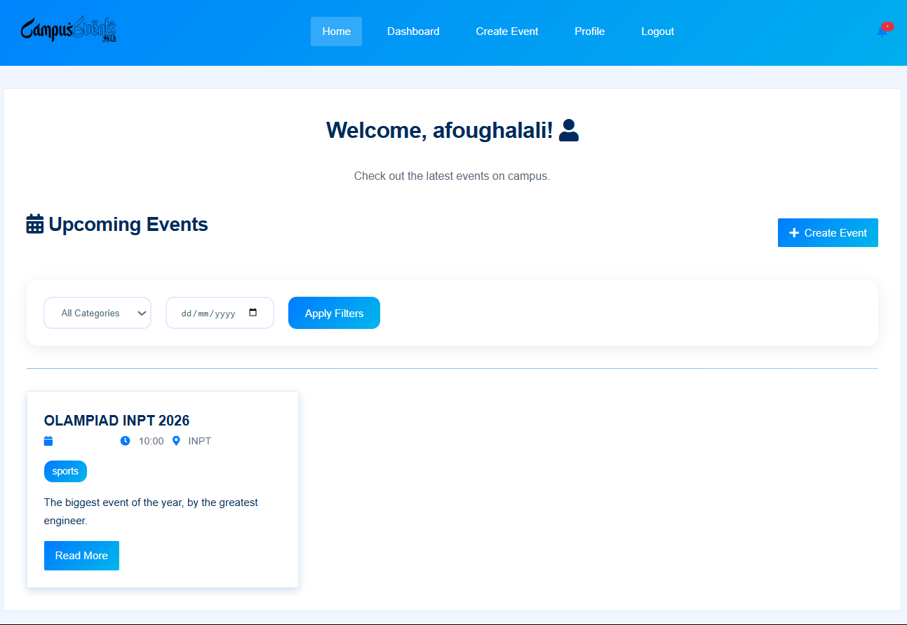

# 🌟 Campus Events Hub

**A vibrant event management platform** connecting students and organizers across campus. Built with Flask, featuring robust authentication and intuitive event management.




## ✨ Key Features

### 🎯 For Students
- 🔍 Browse all upcoming events with beautiful card displays
- 🗂️ Filter by category (Academic, Social, Sports, etc.)
- 📅 Calendar view for easy date-based navigation
- ❤️ Save favorite events with Likes
- ✅ RSVP for events with one click

### 🛠️ For Organizers
- ➕ Create events with rich text descriptions
- ✏️ Edit your events anytime
- 🗑️ Delete events when needed
- 📊 View attendee counts and engagement metrics
- 🔔 Automatic notifications for RSVPs

### 👨‍💻 For Admins
- 👥 User management dashboard
- ✔️ Event approval system
- 📊 Comprehensive analytics
- ⚙️ System configuration

## 🚀 Installation Guide

### Prerequisites
- Python 3.8+
- pip
- SQLite (for development)

### Setup Steps

1. **Clone the repository**
   ```bash
   git clone https://github.com/asharp-chl/Campus-Events-Hub.git
   cd Campus-Events-Hub
